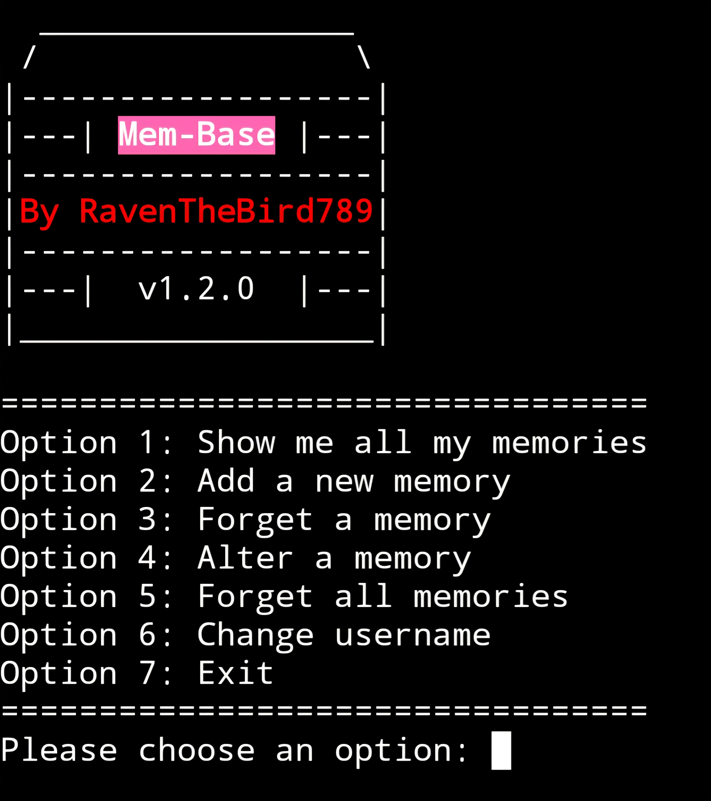

# Mem-Base 🧠🗒️
Python script for a to-do list app that utilizes SHA3-512 and local storage via file handling

 
                  
Requirements
* Ensure the latest version of python is installed in your terminal (python 3.x)

Installation
* To download simply type "git clone https://github.com/RavenTheBird789/Mem-Base" in your command line within your terminal               
         
Execution
* To run, simply type "python3 mem_base.py" in your command line within your terminal or a shortcut can be created in a terminal session using the bash alias command to run the program faster. (Ex: alias run="python3 mem_base.py")

Global Execution (Optional)
* Alternatively, you can run the program globally by simply typing "membase" from anywhere in your terminal, follow these steps:
  1. Make the file executable by typing "chmod +x mem_base.py" in your terminal
  2. Copy the file to a new name using "cp mem_base.py membase" then make that executable too with "chmod +x membase"
  3. Create a local bin folder if you don't already have one using "mkdir -p ~/.local/bin"
  4. Move the file into it using "mv membase ~/.local/bin/"
  5. Make sure that folder is in your PATH by adding "export PATH="HOME/.local/bin:PATH"" to your ~/.bashrc (or ~/.zshrc if you use zsh)
  6. Reload your terminal config using "source ~/.bashrc" (or ~/.zshrc)
  7. Type "membase" from anywhere to run the program

Key Terminology:
* Memories - Reminders for yourself that you write to the "memories.txt" file
* Forgetting - The process of deleting a chosen reminder (memory) from the memories.txt file
* Altering - The process of changing an already existing reminder into something else based on its index

Notes For Usage:
* Whenever adding new memories, it is suggested to write them in proactive second person to increase personalization and accountability for yourself

Updates (For Version 1.2.0)
* Exit animation speed increased
* Redirection to the main menu animation speed increased
* Additional option created to conveniently allow users to update their username (Option 6)
